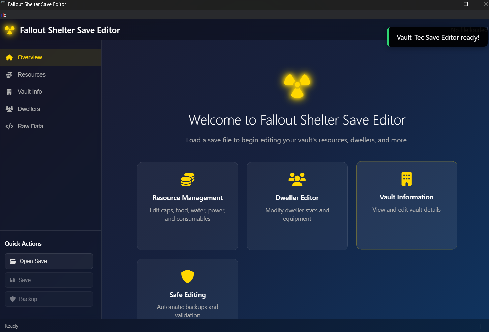

# Fallout Shelter Save Editor

A modern, cross-platform save editor for Fallout Shelter built with Electron.js. Features AES decryption support and a beautiful, intuitive interface.

## Screenshots

### Main Interface

*The main editor interface with resource management*

### Vault Management

*Vault configuration and dweller overview*

### Resource Editor

*Edit caps, resources, and items with ease*

## Latest Release

### Version 1.0.0 (August 2025)
🎉 First stable release with all core features implemented!

**Download:**
- [Windows (64-bit)](https://github.com/poseidonlocal/Fallout-Shelter-Save-Editor/releases/download/v1.0.0/FalloutShelterEditor-Setup-Win-x64.exe)
- [macOS (Universal)](https://github.com/poseidonlocal/Fallout-Shelter-Save-Editor/releases/download/v1.0.0/FalloutShelterEditor-Setup-Mac.dmg)
- [Linux (AppImage)](https://github.com/poseidonlocal/Fallout-Shelter-Save-Editor/releases/download/v1.0.0/FalloutShelterEditor-Linux.AppImage)

**What's New:**
- ✨ Initial release with full save file editing support
- 🔒 AES encryption/decryption implementation
- 🎨 Modern, user-friendly interface
- 💾 Automatic backup system
- 🔧 Resource and vault management features

[View all releases](https://github.com/poseidonlocal/Fallout-Shelter-Save-Editor/releases)

## Features

✨ **Modern Interface** - Beautiful, dark-themed UI with smooth animations
🔐 **AES Decryption** - Properly decrypt and encrypt Fallout Shelter save files
💰 **Resource Editing** - Edit caps, food, water, power, stimpaks, and more
🏠 **Vault Management** - Modify vault name, mode, and theme
👥 **Dweller Overview** - View dweller information and stats
📝 **Raw Data Access** - Direct JSON editing for advanced users
💾 **Safe Backups** - Automatic backup creation before modifications
⚡ **Cross-Platform** - Works on Windows, macOS, and Linux

## Installation

### Option 1: Download Pre-built Binary
1. Go to the [Releases](https://github.com/your-repo/releases) page
2. Download the appropriate version for your operating system
3. Install and run the application

### Option 2: Build from Source

#### Prerequisites
- Node.js 16 or higher
- npm or yarn

#### Steps
1. Clone the repository:
   ```bash
   git clone https://github.com/your-repo/fallout-shelter-save-editor.git
   cd fallout-shelter-save-editor
   ```

2. Install dependencies:
   ```bash
   npm install
   ```

3. Run in development mode:
   ```bash
   npm run dev
   ```

4. Build for production:
   ```bash
   npm run build
   ```

## Usage

### Loading a Save File
1. Launch the application
2. Click "Get Started - Open Save File" or use File → Open Save File
3. Navigate to your Fallout Shelter save directory:
   - **Windows**: `%LOCALAPPDATA%/FalloutShelter/`
   - **macOS**: `~/Library/Application Support/FalloutShelter/`
   - **Android** (with file access): `/Android/data/com.bethsoft.falloutshelter/files/`

### Editing Resources
1. Switch to the "Resources" tab
2. Modify the values for caps, food, water, power, etc.
3. Click "Apply Changes" to save modifications
4. Use "Max All" for maximum resource values

### Vault Information
1. Go to the "Vault Info" tab
2. Edit vault name, mode (Normal/Survival), and theme
3. Apply changes when ready

### Advanced Editing
1. Use the "Raw Data" tab for direct JSON editing
2. Format JSON for better readability
3. Copy data to clipboard for external editing

### Saving Changes
1. Use Ctrl+S (Cmd+S on Mac) or File → Save
2. Create backups with File → Create Backup
3. Use File → Save As to save to a different location

## Save File Locations

### Windows
```
%LOCALAPPDATA%/FalloutShelter/
```

### macOS
```
~/Library/Application Support/FalloutShelter/
```

### Android (Rooted/File Access)
```
/Android/data/com.bethsoft.falloutshelter/files/
```

## Technical Details

### Encryption
Fallout Shelter save files use AES-CBC encryption with:
- **Key**: `a7c2f3f367a2e2e2f0f2b6b1b3b4b5b6b7b8b9babbbcbdbebfc0c1c2c3c4c5c6c7` (hex)
- **IV**: `7475383967656A693334307438397532` (hex)
- **Mode**: CBC with PKCS7 padding
- **Encoding**: Base64

### Save Structure
The decrypted save file is a JSON object containing:
- `vault.storage.resources` - Resource amounts (caps, food, water, etc.)
- `vault.VaultName` - Vault name
- `vault.VaultMode` - Game mode (Normal/Survival)
- `dwellers.dwellers` - Array of dweller data
- And much more...

## Development

### Project Structure
```
├── main.js          # Electron main process
├── renderer.js      # Renderer process (UI logic)
├── index.html       # Main UI
├── styles.css       # Styling
├── package.json     # Dependencies and scripts
└── assets/          # Icons and images
```

### Building
```bash
# Development
npm run dev

# Build for current platform
npm run build

# Build for specific platforms
npm run build-win    # Windows
npm run build-mac    # macOS
npm run build-linux  # Linux
```

## Contributing

1. Fork the repository
2. Create a feature branch: `git checkout -b feature-name`
3. Make your changes and test thoroughly
4. Commit your changes: `git commit -am 'Add feature'`
5. Push to the branch: `git push origin feature-name`
6. Submit a pull request

## Safety & Disclaimers

⚠️ **Important Notes:**
- Always backup your save files before editing
- Use at your own risk - save corruption is possible
- This tool is for educational and personal use only
- Not affiliated with Bethesda Game Studios

## License

This project is licensed under the MIT License - see the [LICENSE](LICENSE) file for details.

## Acknowledgments

- Bethesda Game Studios for Fallout Shelter
- The modding community for reverse engineering the save format
- Electron.js team for the framework
- Font Awesome for icons

## Support

If you encounter issues:
1. Check the [Issues](https://github.com/your-repo/issues) page
2. Create a new issue with detailed information
3. Include your operating system and save file details (without personal data)

---

**Enjoy modifying your vault! 🏠⚡**